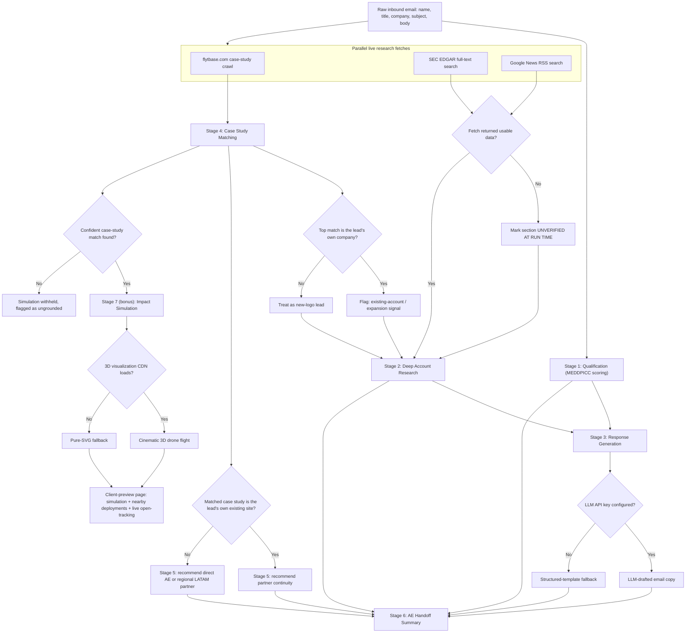

# submission

## What I built

An inbound-lead processing agent that takes one raw inbound email (Rodrigo Castillo, Head of Operations at Sociedad Quimica y Minera de Chile (SQM), referred by Anglo American, asking about autonomous inspection for 3 Atacama lithium sites) as its only input and, on every live run, automatically produces: a qualification assessment, a real-data account research brief, an adaptive multi-email response sequence, a case-study match pulled live from flytbase.com, a partner/go-to-market recommendation, and an AE handoff summary — plus one additional stage beyond the required set: an impact simulation that projects outcomes using only this same account's own already-measured results.

Each stage is a separate, independently callable module with typed input/output, wired together by a thin orchestrator that contains no business logic of its own. A client-facing page renders what the referenced link in the drafted outreach email would actually show the buyer — a live rendering of the same underlying data, not a separate mockup.

## Architecture / Flow

Two decision points sit at the center of the flow, not at the edges. First, Stage 4's match against the lead's own company name (not just the company explicitly named as a referral in the email) determines whether the lead is treated as a cold new-logo or an internal expansion — this single branch changes the tone of Stage 2's positioning recommendation, Stage 3's email framing, and Stage 5's partner choice all at once. Second, whether that same matched case study belongs to the lead's own existing deployment determines whether Stage 5 recommends continuing with that site's existing implementation partner or introducing a new regional one. Every other branch in the diagram is a graceful-degradation path: a missing LLM key, an unreachable fetch, or a failed CDN load all fall back to an explicit, honest alternative rather than failing silently or inventing content.

## Why this solves the brief

The system takes the raw email as its only input and produces every required output itself — nothing in the six stages is hand-written and pasted in. The qualification framework (MEDDPICC) is chosen and justified against the shape of this specific deal: multiple stakeholders, a referral-shaped champion signal, and a dated internal process step, which a simpler framework would flatten. The research stage only ever states what it can actually source live; anything it cannot find is labeled as an open item rather than filled in with a plausible guess. The case-study and partner logic search broadly against terms derived from the email — the lead's own company name as well as the explicitly named referral — rather than matching against one pre-known answer, which is what allows the system to catch that this lead is an existing customer expanding into a new site, not a cold prospect. The response sequence and handoff summary both build directly on what the earlier stages actually found, with the handoff introducing no claim that isn't already established upstream.

## Evidence from the codebase

- `stages/stage1_qualification.py` — `qualify()` extracts every "known" MEDDPICC field from the raw email text via keyword/pattern matching (no fact about SQM or Rodrigo is hard-coded), and builds the priority score from an itemized list of weighted signals, each with its own stated reasoning.
- `fetchers/edgar.py`, `fetchers/news.py`, `fetchers/flytbase_site.py` — live, keyless fetch functions against SEC EDGAR, Google News RSS, and flytbase.com's own case-study pages.
- `stages/stage2_research.py` — `build_research_brief()` explicitly writes `UNVERIFIED AT RUN TIME` into any section where a fetch returned nothing usable, instead of filling the gap with an invented figure.
- `stages/stage4_case_study.py` — scores every fetched case study against terms derived from the email (company name, any referenced company, industry and use-case keywords); confirmed by inspection that no company name is hard-coded anywhere in the matching logic itself, only referenced in surrounding comments explaining the approach.
- `stages/stage5_partner.py` — the partner/motion recommendation logic; also confirmed free of hard-coded company names.
- `stages/stage6_handoff.py` — `build_handoff()` takes the typed outputs of Stages 1–5 as arguments and only recombines them; it introduces no new claim.
- `stages/stage7_simulation.py` and `stages/visual_simulation.py` — the bonus stage; projections are derived only from the matched case study's own real, sourced metrics, and the visualization degrades to a dependency-free SVG rendering if the 3D library's CDN doesn't load.
- `orchestrator.py` — a thin wiring layer with no embedded business logic, calling each stage module in sequence and passing typed results forward.
- `app.py` — includes a `/client-preview` route that renders the buyer-facing version of the Stage 5/7 output, plus a small in-memory counter that tracks and displays opens of that link next to the Stage 3 email's call-to-action.

## Demo / results

From a live run against the fixed input email:

- **Stage 1** produced a MEDDPICC assessment with a priority score of 100/100, built from five weighted, individually-justified signals (cost/safety pain framing, a dated Q3 decision-process signal, explicit stated pain, a warm referral acting as a champion proxy, and multi-site continuous-operation scale) — alongside four explicitly listed open fields (Decision Criteria, Competition, Paper Process, and confirmation of Economic Buyer authority).
- **Stage 2** correctly surfaced, via a live crawl of flytbase.com, that SQM already has an existing case study with FlytBase (a 678 km² site referred to as "Hermosa"), and flagged this lead as a likely internal expansion signal rather than a cold prospect. It also pulled live, dated recent-news items (a Codelco-SQM lithium venture, earnings coverage) and live stakeholder/investor-signal items (a dividend-policy announcement), and returned real (if not perfectly current) SEC filing references for the budget-signals section.
- **Stage 3** generated a three-email sequence with an explicit stated progression: the first email asks about the two biggest qualification gaps while the referral is warm, the second shifts to offering proof if there's no reply, and the third respectfully offers to check back closer to the buyer's own stated Q3 timeline.
- **Stage 4** returned two ranked matches: the SQM case study as the top match, with the stated reason that the lead's own company name appears in it, and the Anglo American case study as a secondary match, reasoned from the explicit referral in the email.
- **Stage 5** recommended a partner-led motion continuing with the same implementation partner already running the lead's existing site, rather than defaulting to a generic regional LATAM partner.
- **Stage 6** synthesized all of the above into a single handoff: buyer context, qualification status with the underlying knowns/unknowns, the top research highlights, the recommended case study and why, and a next step tied back to the Q3 timeline.
- **Stage 7 (bonus)** projected a 2× inspection-frequency uplift, sub-one-year time-to-ROI, and a $70–80K single-zone investment range, scaled from the matched case study's own real, sourced numbers — with an explicit caveat that a 3-site, 24/7 deployment is a materially larger duty cycle than the source site's.
- The **client-preview page** renders live with the same grounded numbers and an open-tracking indicator that correctly transitions from "not opened yet" to a recorded open count after a real page load.

## Notes and limitations

- Without a configured LLM API key, Stage 3 runs in a structured-template mode — still logic-driven from Stage 1 and Stage 2's actual output, not static pre-written copy, but less fluent than an LLM-drafted version would be.
- SEC EDGAR's full-text search returns results ranked by relevance rather than filing date, so the budget-signals section can surface older filings ahead of more recent ones for a given company — the data shown is always real, just not guaranteed to be the most current on file.
- The "nearby deployments" matching is a generic country/region lookup over whatever case studies were actually fetched at run time, so its results depend on what FlytBase has actually published, not a fixed list.
- The 3D visualization depends on an external CDN; a pure-SVG fallback with no external dependency renders automatically if that load fails, so the page never shows a blank panel.
- All live fetches (EDGAR, News, flytbase.com) require outbound network access; in a restricted environment they degrade by explicitly flagging the affected section rather than failing the entire run or inventing a replacement value.
- The open-tracking counter on the client-preview link is an in-memory, single-process proof of concept — it resets on restart and isn't persisted — intended to demonstrate the mechanism, not serve as production analytics.
